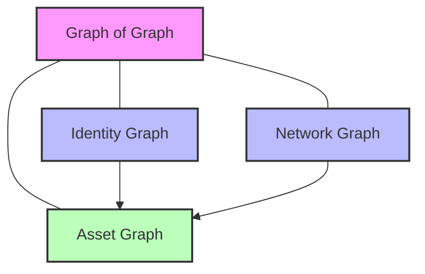

# Unveiling the Power of "Graph of Graph" in Kusto: A Comprehensive Guide with Real-World Use Cases

## Introduction

In today's data-driven security environment, understanding complex relationships between disparate entities is crucial for effective threat detection and response. Kusto Query Language (KQL) offers a powerful capability called "Graph of Graph," which allows analysts to model and analyze interconnected data structures by combining and querying across multiple distinct graph domains.

John Lambert, CVP Security at Microsoft, aptly captures this imperative: "Defenders think in lists. Attackers think in graphs. As long as this is true, attackers win." This insight underscores why sophisticated graph-based analysis is essential in modern cybersecurity. Attackers methodically map connections across identity, network infrastructure, and assets to plan their attacks, requiring defenders to adopt similar capabilities.

## Understanding "Graph of Graph"

### Concepts

The "Graph of Graph" approach involves analyzing relationships between multiple distinct graph domains, using the output of one graph query as input to another. Unlike a traditional unified graph approach where all entities exist in a single graph structure, "Graph of Graph" maintains separation between domain-specific graphs while enabling cross-domain analysis through query composition.

This approach typically involves:

- **Identity Graphs**: Representing users, groups, permissions, and authentication patterns
- **Network Graphs**: Modeling devices, connections, traffic patterns, and protocols
- **Asset Graphs**: Cataloging resources, applications, data repositories, and their relationships

By querying these distinct graphs and composing their results, analysts can trace relationships that cross traditional boundaries, revealing paths that might otherwise remain hidden in siloed data analysis.

### Importance in Security

John Lambert's observation highlights why "Graph of Graph" is vital for security operations. Attackers don't think in terms of isolated domains; they map relationships across identities, networks, and assets to find paths of least resistance.

For defenders, adopting the "Graph of Graph" methodology provides:

- Detection of complex attack chains that span multiple domains
- Visibility into lateral movement paths across different system types
- Identification of security vulnerabilities at the intersection of domains
- Comprehensive impact analysis when incidents occur

## Technical Features and Capabilities

### Graph Operators

Kusto provides several operators specifically designed for graph analysis:

1. **make-graph**: Transforms tabular data into graph structures, creating the foundation for graph analysis.
2. **graph-match**: Searches for specific patterns within a graph, essential for identifying potential attack paths or anomalous relationships.
3. **graph-shortest-paths**: Finds the shortest paths between specified nodes, useful for determining the most efficient routes between entities.
4. **graph-to-table**: Exports graph data back to tabular format for further analysis or reporting.
5. **graph-mark-components**: Identifies and marks connected components, helping to discover distinct clusters in your data.

### Graph Functions

Beyond the basic operators, KQL provides powerful graph functions that enhance analysis capabilities:

1. **inner_nodes()**: Accesses the inner nodes along a variable-length path, enabling analysis of intermediate entities in a path.
2. **map()**: Calculates an expression for each edge or inner node in a path, returning an array of results.
3. **all()**: Evaluates whether all edges or nodes in a path satisfy a given condition.
4. **any()**: Checks if at least one edge or node in a path meets a specified condition.
5. **node_degree_in()**: Calculates the number of incoming edges to a node, useful for identifying "hub" entities.
6. **node_degree_out()**: Calculates the number of outgoing edges from a node, helping detect "source" entities.

These functions provide rich analytical capabilities, allowing security analysts to identify complex patterns and interrogate graph structures in sophisticated ways.

### Graph Query Composition

What makes "Graph of Graph" powerful is the ability to compose queries across multiple graph domains:

- Results from one graph query can be used as constraints in another graph query
- Multiple graph queries can be executed in sequence, building upon each other's results
- Graph functions can be combined to create highly specific pattern matching conditions

## Real-World Use Case: Combining Identity, Network, and Asset Graphs

Detect sophisticated attackers using a combination of compromised credentials, network pivoting, and data access to exfiltrate sensitive information. This detailed example demonstrates how to:

- Model separate domain-specific graphs for identity, network, and assets
- Detect compromised accounts through authentication pattern analysis
- Find sensitive resources within the asset graph
- Identify unusual network connections and lateral movement paths
- Create comprehensive cross-domain attack path analysis

This is where the power of "Graph of Graph" truly shines - seamlessly integrating identity, network, and asset domains to identify sophisticated attack patterns that would be invisible when analyzing each domain independently.

[Read the full Real-World Use Case →](real-world-use-case.md)

## Combining Graph of Graph with Advanced KQL Capabilities

While "Graph of Graph" is powerful on its own, its true potential emerges when combined with other advanced KQL capabilities. This section explores:

- **Time Series Analysis with Graph Context**: Detecting authentication anomalies in the context of user privilege graphs
- **Forecasting with Graph-Enhanced Context**: Predicting security incidents based on both time series trends and graph structure
- **Vector Similarity in Graph Context**: Using ML-derived embeddings to identify similar users with different access levels
- **Comprehensive Security Monitoring**: Integrating all techniques in an end-to-end attack path detection system

By combining these analytical paradigms, security analysts can detect sophisticated attack patterns that would remain invisible when looking at any single data domain in isolation.

[Explore Advanced KQL Capabilities →](advanced-kql-capabilities.md)

## Cross-Domain Relationship Diagrams

Understanding the relationships between different domains is critical when working with "Graph of Graph" analyses. This section illustrates how to diagram cross-domain connections effectively, showing integrated views of multiple domain-specific analyses and providing examples of applications beyond security.

[Learn about cross-domain relationship diagrams and additional use cases →](visualizing-results.md)

## Conclusion

The "Graph of Graph" approach in Kusto provides a powerful framework for analyzing complex, interconnected systems across multiple domains. By enabling analysts to maintain separation between domain-specific graphs while composing queries that span these domains, it offers superior flexibility and scalability compared to unified graph approaches.

John Lambert's observation that "attackers think in graphs" underscores the necessity of this approach for modern security operations. By adopting the "Graph of Graph" methodology, security teams can better anticipate, detect, and respond to sophisticated attacks that traverse traditional domain boundaries.

Whether you're tracking potential security incidents, investigating system anomalies, or proactively hunting for threats, the "Graph of Graph" approach in Kusto offers a powerful toolkit for connecting the dots in your complex data landscape.
