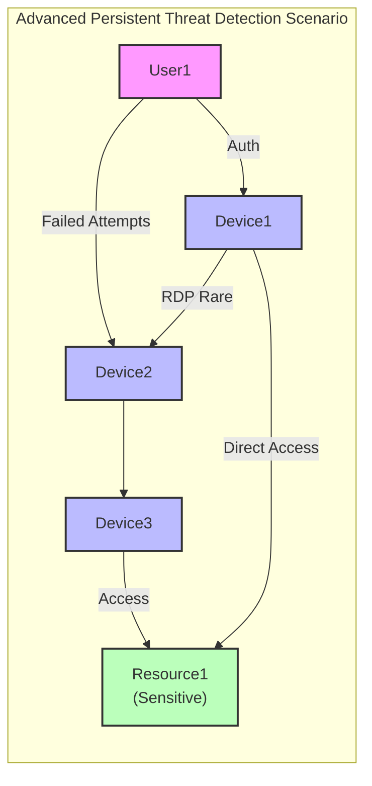
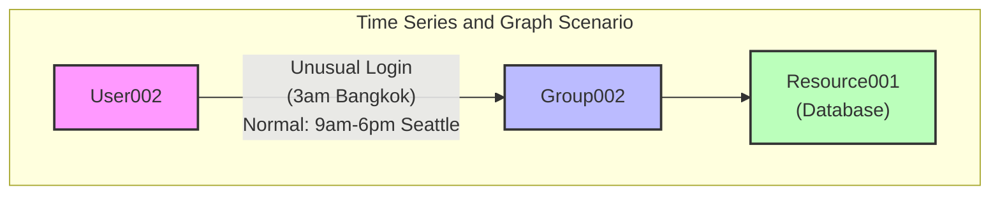
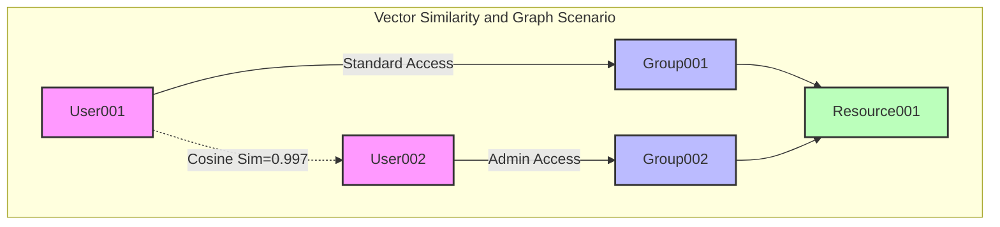
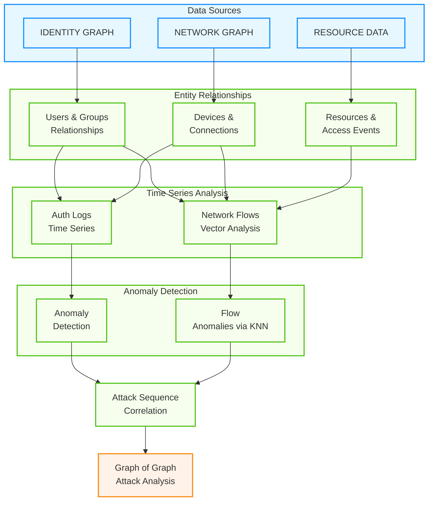
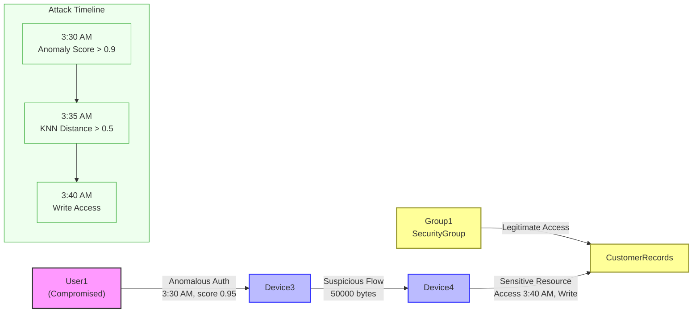
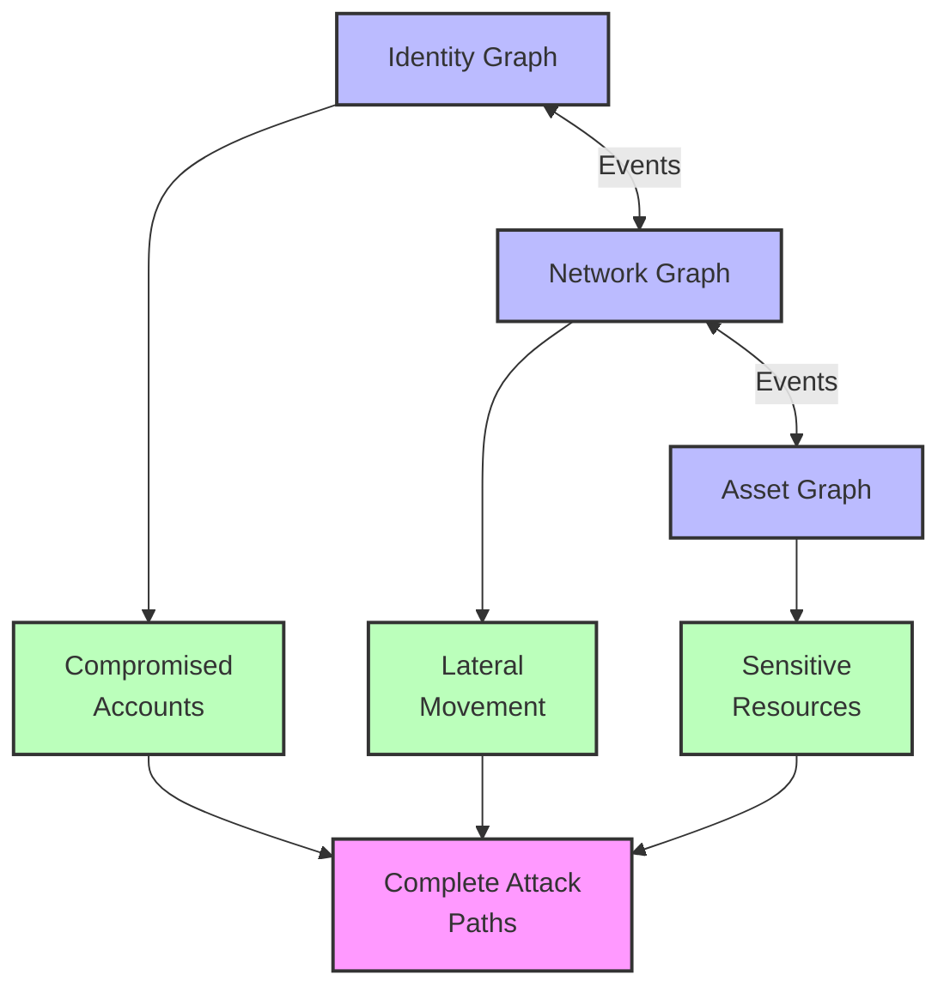

# Unveiling the Power of "Graph of Graph" in Kusto: A Comprehensive Guide with Real-World Use Cases


## Introduction

In today's data-driven security environment, understanding complex relationships between disparate entities is crucial for effective threat detection and response. Kusto Query Language (KQL) offers a powerful capability called "Graph of Graph," which allows analysts to model and analyze interconnected data structures by combining and querying across multiple distinct graph domains.

John Lambert, CVP Security at Microsoft, aptly captures this imperative: "Defenders think in lists. Attackers think in graphs. As long as this is true, attackers win." This insight underscores why sophisticated graph-based analysis is essential in modern cybersecurity. Attackers methodically map connections across identity, network infrastructure, and assets to plan their attacks, requiring defenders to adopt similar capabilities.

## Understanding "Graph of Graph"

### Concepts

The "Graph of Graph" approach involves analyzing relationships between multiple distinct graph domains, using the output of one graph query as input to another. Unlike a traditional unified graph approach where all entities exist in a single graph structure, "Graph of Graph" maintains separation between domain-specific graphs while enabling cross-domain analysis through query composition.

This approach typically involves:

- **Identity Graphs**: Representing users, groups, permissions, and authentication patterns
- **Network Graphs**: Modeling devices, connections, traffic patterns, and protocols
- **Asset Graphs**: Cataloging resources, applications, data repositories, and their relationships

By querying these distinct graphs and composing their results, analysts can trace relationships that cross traditional boundaries, revealing paths that might otherwise remain hidden in siloed data analysis.

### Importance in Security

John Lambert's observation highlights why "Graph of Graph" is vital for security operations. Attackers don't think in terms of isolated domains; they map relationships across identities, networks, and assets to find paths of least resistance.

For defenders, adopting the "Graph of Graph" methodology provides:

- Detection of complex attack chains that span multiple domains
- Visibility into lateral movement paths across different system types
- Identification of security vulnerabilities at the intersection of domains
- Comprehensive impact analysis when incidents occur

## Technical Features and Capabilities

### Graph Operators

Kusto provides several operators specifically designed for graph analysis:

1. **make-graph**: Transforms tabular data into graph structures, creating the foundation for graph analysis.
2. **graph-match**: Searches for specific patterns within a graph, essential for identifying potential attack paths or anomalous relationships.
3. **graph-shortest-paths**: Finds the shortest paths between specified nodes, useful for determining the most efficient routes between entities.
4. **graph-to-table**: Exports graph data back to tabular format for further analysis or reporting.
5. **graph-mark-components**: Identifies and marks connected components, helping to discover distinct clusters in your data.

### Graph Functions

Beyond the basic operators, KQL provides powerful graph functions that enhance analysis capabilities:

1. **inner_nodes()**: Accesses the inner nodes along a variable-length path, enabling analysis of intermediate entities in a path.
2. **map()**: Calculates an expression for each edge or inner node in a path, returning an array of results.
3. **all()**: Evaluates whether all edges or nodes in a path satisfy a given condition.
4. **any()**: Checks if at least one edge or node in a path meets a specified condition.
5. **node_degree_in()**: Calculates the number of incoming edges to a node, useful for identifying "hub" entities.
6. **node_degree_out()**: Calculates the number of outgoing edges from a node, helping detect "source" entities.

These functions provide rich analytical capabilities, allowing security analysts to identify complex patterns and interrogate graph structures in sophisticated ways.

### Graph Query Composition

What makes "Graph of Graph" powerful is the ability to compose queries across multiple graph domains:

- Results from one graph query can be used as constraints in another graph query
- Multiple graph queries can be executed in sequence, building upon each other's results
- Graph functions can be combined to create highly specific pattern matching conditions

## Real-World Use Case: Combining Identity, Network, and Asset Graphs

### Advanced Pattern: Cross-Domain Attack Path Analysis

Consider a scenario where an organization wants to detect sophisticated attackers who might be using a combination of compromised credentials, network pivoting, and data access to exfiltrate sensitive information. Instead of building a single unified graph, we'll maintain separate graphs for each domain and compose queries across them.



Let's model this scenario with KQL graph semantics ([full example](advancedPersistentThreadDetection.kql)):

```kusto
// 1. IDENTITY GRAPH - Users, groups and permissions
let IdentityNodes = datatable(id:string, type:string, properties:dynamic)
[
  "User1", "User", dynamic({"department": "Finance", "accessLevel": "Standard"}),
  "User2", "User", dynamic({"department": "IT", "accessLevel": "Admin"}),
  "User3", "User", dynamic({"department": "Marketing", "accessLevel": "Standard"}),
  "Group1", "Group", dynamic({"name": "Finance-Users"}),
  "Group2", "Group", dynamic({"name": "IT-Admins"})
];
let IdentityEdges = datatable(source:string, target:string, relationship:string)
[
  "User1", "Group1", "MemberOf",
  "User2", "Group2", "MemberOf",
  "User3", "Group1", "MemberOf",
  "Group1", "Resource1", "HasAccess",
  "Group2", "Resource2", "HasAccess"
];
// Build Identity Graph
let IdentityGraph = IdentityEdges
| make-graph source --> target with IdentityNodes on id;

// 2. NETWORK GRAPH - Devices and connections
let NetworkNodes = datatable(id:string, type:string, properties:dynamic)
[
  "Device1", "Workstation", dynamic({"os": "Windows 10", "location": "Finance Dept"}),
  "Device2", "Server", dynamic({"os": "Windows Server", "location": "Datacenter"}),
  "Device3", "Workstation", dynamic({"os": "MacOS", "location": "Marketing Dept"})
];
let NetworkEdges = datatable(source:string, target:string, relationship:string, properties:dynamic)
[
  "Device1", "Device2", "ConnectsTo", dynamic({"protocol": "RDP", "frequency": "Rare"}),
  "Device2", "Device3", "ConnectsTo", dynamic({"protocol": "SSH", "frequency": "Regular"}),
  "Device2", "Device4", "ConnectsTo", dynamic({"protocol": "SSH", "frequency": "Regular"})
];
// Build Network Graph
let NetworkGraph = NetworkEdges
| make-graph source --> target with NetworkNodes on id;

// 3. ASSET GRAPH - Resources and their relationships
let AssetNodes = datatable(id:string, type:string, properties:dynamic)
[
  "Resource1", "Database", dynamic({"name": "FinancialDB", "sensitivity": "High"}),
  "Resource2", "FileShare", dynamic({"name": "ITShare", "sensitivity": "Medium"})
];
let AssetEdges = datatable(source:string, target:string, relationship:string)
[
  "Resource1", "Resource2", "DependsOn"
];
// Build Asset Graph
let AssetGraph = AssetEdges
| make-graph source --> target with AssetNodes on id;

// 4. Authentication Events - Connect Identity and Network graphs
let AuthEvents = datatable(user:string, device:string, timestamp:datetime, success:bool)
[
  "User1", "Device1", datetime(2025-04-15T08:30:00Z), true,
  "User2", "Device2", datetime(2025-04-15T09:15:00Z), true,
  "User1", "Device2", datetime(2025-04-15T10:20:00Z), false,
  "User1", "Device2", datetime(2025-04-15T10:21:00Z), false,
  "User1", "Device2", datetime(2025-04-15T10:23:00Z), false,
  "User2", "Device3", datetime(2025-04-15T11:05:00Z), true
];
// 5. Resource Access Events - Connect Network and Asset graphs
let AccessEvents = datatable(device:string, resource:string, timestamp:datetime, accessType:string)
[
  "Device1", "Resource1", datetime(2025-04-15T08:45:00Z), "Read",
  "Device2", "Resource2", datetime(2025-04-15T10:35:00Z), "Read",
  "Device3", "Resource1", datetime(2025-04-15T11:10:00Z), "Read/Write"
];
```

We can extend this approach to detect complex attack paths by using the output of one graph query as constraints for another. This is the essence of "Graph of Graph" - using graph patterns to inform other graph patterns:

```kusto
// Starting with previously defined graphs and events...

// STEP 1: Find compromised accounts through analyzing authentication patterns
let CompromisedAccounts = 
    // Create a specialized auth graph
    AuthEvents
    | summarize FailedAttempts=countif(success == false), 
                SuccessfulAttempts=countif(success == true),
                Times=make_list(timestamp) by user
    | where FailedAttempts >= 3 and SuccessfulAttempts >= 1
    | project user;

// STEP 2: Find sensitive resources in the Asset graph using graph patterns
let SensitiveResources = AssetGraph
    | graph-match (resource)--(connected)
        where resource.properties.sensitivity == "High"
        project resource.id;

// STEP 3: Find unusual network connections using the Network graph
let UnusualConnections = NetworkGraph
    | graph-match (source)-[connection]->(target)
        where connection.properties.frequency == "Rare"
        project SourceDevice = source.id, TargetDevice = target.id;

// STEP 4: Analyze the Identity graph for permission chains
let PermissionChains = IdentityGraph
    | graph-match (user)-[memberOf*1..2]->(group)-[access]->(resource)
        where user.id in (CompromisedAccounts)
        and resource.id in (SensitiveResources)
        // Use the node degree to filter for groups with high connectivity
        and node_degree_in(group) >= 2
        project 
            UserId = user.id, 
            GroupCount = node_degree_in(group),  // Number of members in the group
            ResourceId = resource.id;

// STEP 5: Find lateral movement paths in the Network graph
let LateralMovementPaths = NetworkGraph
    | graph-match (initialDevice)-[connections*1..3]->(targetDevice)
        where initialDevice.id in (
            // Devices accessed by compromised users
            AuthEvents
            | where user in (CompromisedAccounts) and success
            | distinct device
        )
        // Use inner_nodes and any() to find paths with specific characteristics
        and any(inner_nodes(connections), node_degree_out() > 0)  // Path contains a "hub" device
        project
            InitialDevice = initialDevice.id,
            TargetDevice = targetDevice.id,
            PathLength = array_length(map(connections, source)),
            HubDevices = map(inner_nodes(connections), 
                            iff(node_degree_out() > 1, id, ""));

// STEP 6: Use a comprehensive graph pattern to find data exfiltration paths
// This is where Graph of Graph truly shines - we use all our previous analyses together

// Create a graph from authentication and resource access data
// First, prepare the graph edges properly with explicit source-target pairs
let UserDeviceEdges = AuthEvents
    | where user in (CompromisedAccounts)
    | where success == true
    | join kind=inner (
        AccessEvents
        | where resource in (SensitiveResources)
    ) on device
    | distinct user, device, resource
    // Create user->device edges
    | project source=user, target=device, relationship="LoggedInto";

let DeviceResourceEdges = 
    AccessEvents
    | where resource in (SensitiveResources)
    | distinct device, resource
    // Create device->resource edges
    | project source=device, target=resource, relationship="AccessedResource";

let DeviceToDeviceEdges = NetworkEdges
    // Create device->device edges
    | project source=source, target=target, relationship="AccessedDevice";

// Combine all edges to create a complete graph
let AllEdges = union
    UserDeviceEdges,
    DeviceResourceEdges, 
    DeviceToDeviceEdges;

// Create the graph with proper source/target pairs
let UserDeviceResourceGraph = AllEdges
    | make-graph source --> target with_node_id=id;

// Find complete attack paths using a complex pattern across all domains
UserDeviceResourceGraph
| graph-match (compromisedUser)-->(initialDevice)-[hop*0..3]->(sensitiveResource)
    where 
        // Connect with our identity analysis
        compromisedUser.id in (CompromisedAccounts)
        // Connect with our asset analysis
        and sensitiveResource.id in (SensitiveResources)
    project
        CompromisedUser = compromisedUser,
        InitialDevice = initialDevice,
        SensitiveResourceAccessed = sensitiveResource,
        Path = hop,
        // Report if user has legitimate permissions (additional context)
        HasLegitimateAccess = compromisedUser in 
            (PermissionChains | where ResourceId == sensitiveResource | project UserId)
// Connect with our network analysis - look for rare connections
| mv-apply hop=Path on (
    where strcat(hop.source, hop.target) in (UnusualConnections | project strcat(SourceDevice, TargetDevice))
    | summarize RareConnections=count()
)
```

**Result**:

|CompromisedUser|InitialDevice|SensitiveResourceAccessed|Path|HasLegitimateAccess|RareConnections|
|---|---|---|---|---|---|
|{<br>  "id": "User1"<br>}|{<br>  "id": "Device1"<br>}|{<br>  "id": "Resource1"<br>}|[<br>  {<br>    "source": "Device1",<br>    "target": "Resource1",<br>    "relationship": "AccessedResource"<br>  }<br>]|False|0|
|{<br>  "id": "User1"<br>}|{<br>  "id": "Device1"<br>}|{<br>  "id": "Resource1"<br>}|[<br>  {<br>    "source": "Device1",<br>    "target": "Device2",<br>    "relationship": "AccessedDevice"<br>  },<br>  {<br>    "source": "Device2",<br>    "target": "Device3",<br>    "relationship": "AccessedDevice"<br>  },<br>  {<br>    "source": "Device3",<br>    "target": "Resource1",<br>    "relationship": "AccessedResource"<br>  }<br>]|False|1|

This pattern demonstrates the true power of "Graph of Graph" in Kusto:

1. **Using Multiple Functions for Deeper Analysis**:
   - `node_degree_in` and `node_degree_out` identify important hub entities
   - `inner_nodes` examines intermediate nodes along paths
   - `any()` and `all()` ensure paths meet specific criteria
   - `map()` extracts properties and creates detailed path information

1. **Building Domain-Specific Insights**: Each step creates specialized graph structures and extracts specific patterns:
   - Authentication patterns to identify compromised accounts
   - Asset relationships to identify sensitive resources
   - Network patterns to identify unusual connections
   - Permission patterns to identify legitimate access paths

1. **Using Graph Results as Constraints**: The final comprehensive pattern uses the outputs of previous graph analyses as constraints:
   - Filtering users to only those identified as compromised
   - Filtering resources to only those identified as sensitive
   - Filtering connection paths to include unusual network activity
   - Providing context about legitimate access paths

1. **Correlating Across Domains**: The final graph pattern seamlessly integrates identity, network, and asset domains to identify sophisticated attack patterns that would be invisible when analyzing each domain independently.

## Combining Graph of Graph with Advanced KQL Capabilities

While the "Graph of Graph" pattern is powerful on its own, its true potential emerges when combined with other advanced KQL capabilities like time series analysis, anomaly detection, forecasting, and vector operations. By integrating these different analytical paradigms, security analysts can create sophisticated solutions that leverage the best of each approach.

### Time Series Analysis with Graph Context

One of the most powerful integrations is combining graph analysis with time series analytics.



Consider a scenario where we need to analyze authentication anomalies in the context of a user privilege graph ([full example](timeseriesAndGraph.kql)):

```kusto
// 1. Define the identity graph with users and their privileges
let IdentityNodes = datatable(id:string, type:string, department:string, privilegeLevel:string)
[
  "User001", "Employee", "Finance", "Standard",
  "User002", "Employee", "IT", "Admin",
  "User003", "Employee", "HR", "Standard",
  "Group001", "SecurityGroup", "Finance", "Finance-Access",
  "Group002", "SecurityGroup", "IT", "Admin-Access",
  "Resource001", "Database", "Finance", "Restricted"
];

let IdentityEdges = datatable(source:string, target:string, relationshipType:string)
[
  "User001", "Group001", "memberOf",
  "User002", "Group002", "memberOf",
  "Group001", "Resource001", "canAccess",
  "Group002", "Resource001", "canAdminister"
];

// 2. Define time series data for authentication events
let AuthEvents = datatable(userId:string, timestamp:datetime, eventType:string, success:bool, location:string)
[
  // Normal authentication pattern
  "User001", datetime(2025-04-15T08:00:00Z), "login", true, "Seattle",
  "User001", datetime(2025-04-15T17:05:00Z), "logout", true, "Seattle",
  "User001", datetime(2025-04-16T08:10:00Z), "login", true, "Seattle",
  "User001", datetime(2025-04-16T17:15:00Z), "logout", true, "Seattle",
  // User002 normal pattern
  "User002", datetime(2025-04-15T09:00:00Z), "login", true, "Seattle",
  "User002", datetime(2025-04-15T18:00:00Z), "logout", true, "Seattle",
  // Anomalous pattern - unusual time and location
  "User002", datetime(2025-04-16T03:20:00Z), "login", true, "Bangkok",
  "User002", datetime(2025-04-16T03:25:00Z), "accessResource", true, "Bangkok",
  "User002", datetime(2025-04-16T03:40:00Z), "logout", true, "Bangkok"
];

// 3. Use series_decompose_anomalies to detect unusual login patterns
let AnomalousUsers = AuthEvents
| where eventType == "login" and success == true
| make-series LoginCount=count() on timestamp from datetime(2025-04-15) to datetime(2025-04-17) step 1h by userId
| extend (anomalies, scores, baseline) = series_decompose_anomalies(LoginCount, 1.5, -1, 'linefit')
| where anomalies has "1"
| distinct userId;

// 4. Create the identity graph
let IdentityGraph = IdentityEdges
| make-graph source --> target with IdentityNodes on id;

// 5. Find the sensitive resources that anomalous users can access
IdentityGraph
| graph-match (anomalousUser)-[access*1..3]->(sensitiveResource)
    where anomalousUser.id in (AnomalousUsers)
    and sensitiveResource.type == "Database"
    project 
        AnomalousUser = anomalousUser.id, 
        Department = anomalousUser.department,
        PrivilegeLevel = anomalousUser.privilegeLevel,
        SensitiveResource = sensitiveResource.id,
        // Use the map() function to extract the access path
        AccessPath = map(access, target)
```

**Result**:

|AnomalousUser|Department|PrivilegeLevel|SensitiveResource|AccessPath|
|---|---|---|---|---|
|User002|IT|Admin|Resource001|[<br>  "Group002",<br>  "Resource001"<br>]|

This query demonstrates how to:

1. Detect anomalies using `series_decompose_anomalies()` on time series authentication data
1. Build a graph representation of the identity and access structure
1. Trace the potential impact of compromised accounts on sensitive resources
1. Use graph functions to extract detailed access path information

The result provides security intelligence that combines time series anomaly detection with identity analysis - showing exactly which critical resources might be at risk when a user's authentication pattern becomes unusual.

### Forecasting with Graph-Enhanced Context

We can extend this approach by incorporating forecasting to predict potential security incidents based on both time series trends and graph structure:

```kusto
// Use previously defined tables and add forecasting
let ForecastedRiskyUsers = AuthEvents
| where eventType == "login" and success == true
| make-series LoginCount=count() on timestamp from datetime(2025-04-15) to datetime(2025-04-17) step 1h by userId
| extend forecast = series_decompose_forecast(LoginCount, 24) // Forecast next 24 hours
| mv-expand timestamp, LoginCount, forecast
| extend unusual_forecast = forecast > 5 // Threshold for unusual login activity
| summarize will_exceed = max(unusual_forecast) by userId;

// Find potential privilege escalation paths from forecasted risky users
IdentityGraph
| graph-match (forecastedRiskyUser)-[memberOf]->(group)-[canAccess]->(sensitiveResource)
    where forecastedRiskyUser.id in (ForecastedRiskyUsers | where will_exceed == 1 | project userId)
    and sensitiveResource.type == "Database"
    project 
        RiskyUser = forecastedRiskyUser.id, 
        AccessGroup = group.id,
        ResourceAtRisk = sensitiveResource.id,
        RecommendedAction = "Increase monitoring on this account"
```

### Vector Similarity in Graph Context

Another powerful combination is using vector operations within a security graph context, particularly useful for identifying similar attack patterns or entity relationships ([full example](vectorSimilarityAndGraph.kql)):



```kusto
// Define embeddings for user behaviors (as if from an ML model)
let UserBehaviorEmbeddings = datatable(userId:string, behaviorEmbedding:dynamic)
[
  "User001", dynamic([0.2, 0.5, 0.1, 0.8, 0.3]),
  "User002", dynamic([0.25, 0.48, 0.15, 0.82, 0.28]), // Similar to User001
  "User003", dynamic([0.7, 0.2, 0.6, 0.1, 0.9]),      // Different pattern
  "User004", dynamic([0.72, 0.19, 0.58, 0.12, 0.88]), // Similar to User003
  "User005", dynamic([0.22, 0.51, 0.12, 0.79, 0.31])  // Similar to User001
];

// Calculate cosine similarity between users' behavior patterns
let SimilarityScores = UserBehaviorEmbeddings
| extend vector1 = behaviorEmbedding, dummy=1
| join kind=inner (
    UserBehaviorEmbeddings
    | extend vector2 = behaviorEmbedding, dummy=1
) on dummy // Cross join
| where userId != userId1
| extend similarity = series_cosine_similarity(vector1, vector2)
| project User1 = userId, User2 = userId1, CosineSimilarity = similarity;

// Find users with similar behavior patterns but different access levels
let SimilarUsersWithDifferentAccess = SimilarityScores
| where CosineSimilarity > 0.95
| join kind=inner (
    IdentityNodes
    | project userId = id, department, privilegeLevel 
) on $left.User1 == $right.userId
| join kind=inner (
    IdentityNodes
    | project userId = id, department2 = department, privilegeLevel2 = privilegeLevel
) on $left.User2 == $right.userId
| where privilegeLevel != privilegeLevel2
| project User1 = userId, User2, Similarity = CosineSimilarity, 
         Department1 = department, PrivilegeLevel1 = privilegeLevel,
         Department2 = department2, PrivilegeLevel2 = privilegeLevel2;

// Use identity graph to find potentially excessive privileges
IdentityGraph
| graph-match (u1)-[access1*1..3]->(resource)<-[access2*1..3]-(u2)
    where strcat(u1.id, u2.id) in (
        SimilarUsersWithDifferentAccess
        | project pair = strcat(User1, User2)
    )
    and u1.privilegeLevel != "Admin" and u2.privilegeLevel == "Admin"
    project 
        StandardUser = u1.id,
        SimilarAdminUser = u2.id,
        ResourceWithSharedAccess = resource.id,
        RecommendedAction = "Review privilege levels - potential excessive permissions"
| lookup kind=inner 
    SimilarUsersWithDifferentAccess on 
        $left.StandardUser == $right.User1 and
        $left.SimilarAdminUser == $right.User2
| project StandardUser, SimilarAdminUser, ResourceWithSharedAccess, RecommendedAction, Similarity
```

**Result**:

|StandardUser|SimilarAdminUser|ResourceWithSharedAccess|RecommendedAction|Similarity|
|---|---|---|---|---|
|User001|User002|Resource001|Review privilege levels - potential excessive permissions|0,997190974309329|

This example demonstrates how to:

1. Use vector embeddings to represent user behavior patterns
1. Calculate cosine similarity between users to find behavioral matches
1. Identify users with similar behavior but different privilege levels
1. Use graph traversal to find resources accessible by both users

This approach combines the power of vector operations with graph traversal to identify potential security policy issues where users with similar behavior patterns have significantly different access levels.

### Putting It All Together: A Comprehensive Example

To fully demonstrate the power of combining "Graph of Graph" with other KQL capabilities, let's integrate all these techniques in a comprehensive security monitoring scenario ([full example](puttingItAllTogether.kql)):

The following picture shows the overall data sources and graph structure.



Now let's look at the actual structure of the query.

```kusto
// 1. IDENTITY GRAPH - Users and permissions
let IdentityGraph = IdentityEdges
| make-graph source --> target with IdentityNodes on id;

// 2. NETWORK GRAPH - Devices and connections  
let NetworkGraph = NetworkEdges
| make-graph source --> target with NetworkNodes on id;

// 3. Time Series Authentication Data
let AuthLogs = datatable(user:string, device:string, timestamp:datetime, success:bool, anomalyScore:double)
[
  // Normal authentication patterns
  "User1", "Device1", datetime(2025-04-15T08:30:00Z), true, 0.1,
  "User2", "Device2", datetime(2025-04-15T09:15:00Z), true, 0.2,
  // Anomalous authentication
  "User1", "Device3", datetime(2025-04-15T03:30:00Z), true, 0.95 // Unusual time and device
];

// 4. Network Flow Time Series with vector embeddings
let NetworkFlows = datatable(sourceDevice:string, destDevice:string, timestamp:datetime, bytesTransferred:long, flowEmbedding:dynamic)
[
  // Historical benign flows (for reference data)
  "Device1", "Device2", datetime(2025-04-01T08:35:00Z), 1500, dynamic([0.1, 0.2, 0.3, 0.4, 0.5]),
  "Device1", "Device2", datetime(2025-04-02T08:32:00Z), 1490, dynamic([0.12, 0.19, 0.31, 0.39, 0.51]),
  "Device1", "Device2", datetime(2025-04-03T08:36:00Z), 1510, dynamic([0.11, 0.21, 0.29, 0.41, 0.49]),
  "Device1", "Device2", datetime(2025-04-04T08:37:00Z), 1520, dynamic([0.09, 0.22, 0.31, 0.38, 0.52]),
  "Device1", "Device2", datetime(2025-04-05T08:33:00Z), 1480, dynamic([0.11, 0.18, 0.32, 0.42, 0.48]),
  "Device2", "Device4", datetime(2025-04-01T09:21:00Z), 2480, dynamic([0.16, 0.24, 0.36, 0.43, 0.56]),
  "Device2", "Device4", datetime(2025-04-02T09:22:00Z), 2510, dynamic([0.14, 0.26, 0.34, 0.46, 0.54]),
  "Device2", "Device4", datetime(2025-04-03T09:20:00Z), 2490, dynamic([0.15, 0.25, 0.35, 0.45, 0.55]),
  "Device2", "Device4", datetime(2025-04-04T09:19:00Z), 2520, dynamic([0.17, 0.23, 0.33, 0.47, 0.53]),
  "Device2", "Device4", datetime(2025-04-05T09:18:00Z), 2530, dynamic([0.13, 0.27, 0.37, 0.44, 0.57]),
  // Recent flows including normal and anomalous patterns
  "Device1", "Device2", datetime(2025-04-15T08:35:00Z), 1500, dynamic([0.1, 0.2, 0.3, 0.4, 0.5]),
  "Device2", "Device4", datetime(2025-04-15T09:20:00Z), 2500, dynamic([0.15, 0.25, 0.35, 0.45, 0.55]),
  "Device3", "Device4", datetime(2025-04-15T03:35:00Z), 50000, dynamic([0.8, 0.7, 0.9, 0.3, 0.1]) // Anomalous transfer after suspicious login
];

// 5. Sensitive Resource Access Events
let ResourceAccess = datatable(device:string, resource:string, timestamp:datetime, accessType:string)
[
  "Device2", "FinancialDatabase", datetime(2025-04-15T09:30:00Z), "Read",
  "Device4", "CustomerRecords", datetime(2025-04-15T03:40:00Z), "Write" // Suspicious write after anomalous transfer
];

// 6. Detect authentication anomalies
let AnomalousAuth = AuthLogs
| where anomalyScore > 0.9
| project user, device, timestamp;

// 7. Detect unusual network flows using Python plugin for KNN
let KnownBenignFlows = NetworkFlows
| where timestamp between(datetime(2025-04-01) .. datetime(2025-04-14))
| project flowEmbedding;
let AnomalousFlows = NetworkFlows
| extend known_benign = toscalar(KnownBenignFlows)
| evaluate python(
    typeof(sourceDevice:string, destDevice:string, timestamp:datetime, knnDistance:double),
'''
import numpy as np
from sklearn.neighbors import NearestNeighbors

# Extract the query embeddings (what we want to test)
query_embeddings = np.vstack([np.array(x) for x in df["flowEmbedding"]])
query_devices_source = df["sourceDevice"].tolist()
query_devices_dest = df["destDevice"].tolist()
query_timestamps = df["timestamp"].tolist()

# Extract the known benign embeddings for reference
known_benign_embeddings = np.vstack([np.array(x) for x in df["known_benign"]])

# Initialize and fit KNN model with k=5
k = 5
if len(known_benign_embeddings) >= k:
    knn = NearestNeighbors(n_neighbors=k)
    knn.fit(known_benign_embeddings)
    
    # Get distances to 5 nearest neighbors for each query
    distances, _ = knn.kneighbors(query_embeddings)
    
    # Average distance for each query point
    avg_distances = np.mean(distances, axis=1)
    
    # Return results
    result = pd.DataFrame({
        "sourceDevice": query_devices_source,
        "destDevice": query_devices_dest,
        "timestamp": query_timestamps,
        "knnDistance": avg_distances.tolist()
    })
else:
    # Not enough reference points for KNN
    result = pd.DataFrame({
        "sourceDevice": query_devices_source,
        "destDevice": query_devices_dest,
        "timestamp": query_timestamps,
        "knnDistance": [0.0] * len(query_devices_source)
    })
'''
)
| where knnDistance > 0.5 // Higher distance means more unusual
| project sourceDevice, destDevice, timestamp;

// 8. Graph traversal to find complete attack paths
let AttackSequence = AnomalousAuth
| join kind=inner (AnomalousFlows) on $left.device == $right.sourceDevice
| extend abs(timestamp - timestamp1) < 10m // Flow occurred within 10 minutes of anomalous auth
| project user, initialDevice = device, compromisedDevice = destDevice, authTime = timestamp, flowTime = timestamp1;

// 9. Look for sensitive resource access following the attack sequence
let SuspiciousAccess = AttackSequence
| join kind=inner (ResourceAccess) on $left.compromisedDevice == $right.device
| where timestamp between (flowTime .. 1h) // Access occurred within an hour of suspicious flow
| project user, initialDevice, compromisedDevice, resource, AccessTime = timestamp, accessType;

// 10. Use IdentityGraph to find the user's legitimate permissions
let UserPermissions = IdentityGraph
| graph-match (user)-[memberOf*0..3]->(group)-[access]->(resource)
    where user.id in (SuspiciousAccess | project user) and group.type == "SecurityGroup"
    project UserId = user.id, ResourceId = resource.id;

// 11. Complete attack chain analysis using Graph of Graph pattern
SuspiciousAccess
| join kind=innerunique UserPermissions 
    on $left.user == $right.UserId and $left.resource == $right.ResourceId
| join kind=innerunique (AnomalousAuth | project user, device, AuthTime=timestamp ) 
    on user and $left.initialDevice == $right.device
| join kind=innerunique (AnomalousFlows | project sourceDevice , destDevice, FlowTime=timestamp ) 
    on $left.initialDevice == $right.sourceDevice and $left.compromisedDevice == $right.destDevice
| extend AttackDuration = AccessTime - AuthTime
| project
    CompromisedUser = user,
    AuthAnomalyDevice = initialDevice,
    NetworkPivot = compromisedDevice,
    SensitiveResourceAccessed = resource,
    AccessType = accessType,
    AttackTimelineSeries = bag_pack_columns(AccessTime, AuthTime, FlowTime),
    TotalAttackDurationMinutes = AttackDuration / 1m,
    PotentialDataExfiltration = accessType == "Write"
```

**Result**:

|CompromisedUser|AuthAnomalyDevice|NetworkPivot|SensitiveResourceAccessed|AccessType|AttackTimelineSeries|TotalAttackDurationMinutes|PotentialDataExfiltration|
|---|---|---|---|---|---|---|---|
|User1|Device3|Device4|CustomerRecords|Write|{<br>  "accessTime": "2025-04-15T03:40:00.0000000Z",<br>  "AuthTime": "2025-04-15T03:30:00.0000000Z",<br>  "FlowTime": "2025-04-15T03:35:00.0000000Z"<br>}|10|True|

The following picture shows the attack path detected in the example: User1's anomalous authentication to Device3, followed by suspicious network flow to Device4, and culminating in unauthorized write access to CustomerRecords - all happening within a 10-minute timeframe.



This comprehensive example demonstrates the true power of "Graph of Graph" when combined with other KQL capabilities:

1. **Time Series Analysis**: Authentication logs and network flows are analyzed as time series data to establish temporal relationships
2. **Anomaly Detection**: Both rule-based scoring and vector similarity are used to detect unusual patterns
3. **Vector Operations**: Network flow embeddings are compared using K-nearest neighbors to find outliers
4. **Graph Traversal**: Multiple graphs are queried separately and then correlated to build a complete attack chain
5. **Temporal Correlation**: The timing between events across different domains is analyzed to establish causality

By combining these different analytical paradigms, security analysts can detect sophisticated attack patterns that would be invisible when looking at any single data domain in isolation.

## Visualizing Graph of Graph Results

The results from "Graph of Graph" analyses can be visualized as interconnected diagrams that clearly display cross-domain relationships:



This visual representation shows how separate domain-specific analyses feed into a comprehensive understanding of potential attack paths.

## Additional Use Cases for Graph of Graph

Beyond security, the "Graph of Graph" approach in Kusto can be applied to various domains:

### Supply Chain Optimization

By analyzing:

- **Supplier Graphs**: Representing supplier relationships and capabilities
- **Logistics Graphs**: Modeling transportation routes, times, and costs
- **Inventory Graphs**: Tracking inventory levels and dependencies

Organizations can identify optimal sourcing strategies, predict potential bottlenecks, and create resilient supply chains by connecting these separate graph domains.

### Customer Journey Analysis

By connecting:

- **Customer Identity Graphs**: Representing customer profiles and segments
- **Interaction Graphs**: Modeling touchpoints across channels
- **Product Graphs**: Cataloging product relationships and dependencies

Businesses can trace complete customer journeys across channels, identify high-value conversion paths, and optimize the overall customer experience.

## Conclusion

The "Graph of Graph" approach in Kusto provides a powerful framework for analyzing complex, interconnected systems across multiple domains. By enabling analysts to maintain separation between domain-specific graphs while composing queries that span these domains, it offers superior flexibility and scalability compared to unified graph approaches.

John Lambert's observation that "attackers think in graphs" underscores the necessity of this approach for modern security operations. By adopting the "Graph of Graph" methodology, security teams can better anticipate, detect, and respond to sophisticated attacks that traverse traditional domain boundaries.

Whether you're tracking potential security incidents, investigating system anomalies, or proactively hunting for threats, the "Graph of Graph" approach in Kusto offers a powerful toolkit for connecting the dots in your complex data landscape.
