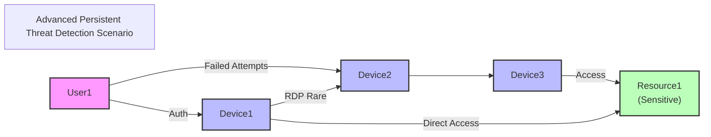

# Real-World Use Case: Combining Identity, Network, and Asset Graphs

### Advanced Pattern: Cross-Domain Attack Path Analysis

Consider a scenario where an organization wants to detect sophisticated attackers who might be using a combination of compromised credentials, network pivoting, and data access to exfiltrate sensitive information. Instead of building a single unified graph, we'll maintain separate graphs for each domain and compose queries across them.



Let's model this scenario with KQL graph semantics ([full example](advancedPersistentThreadDetection.kql)):

```kusto
// 1. IDENTITY GRAPH - Users, groups and permissions
let IdentityNodes = datatable(id:string, type:string, properties:dynamic)
[
  "User1", "User", dynamic({"department": "Finance", "accessLevel": "Standard"}),
  "User2", "User", dynamic({"department": "IT", "accessLevel": "Admin"}),
  "User3", "User", dynamic({"department": "Marketing", "accessLevel": "Standard"}),
  "Group1", "Group", dynamic({"name": "Finance-Users"}),
  "Group2", "Group", dynamic({"name": "IT-Admins"})
];
let IdentityEdges = datatable(source:string, target:string, relationship:string)
[
  "User1", "Group1", "MemberOf",
  "User2", "Group2", "MemberOf",
  "User3", "Group1", "MemberOf",
  "Group1", "Resource1", "HasAccess",
  "Group2", "Resource2", "HasAccess"
];
// Build Identity Graph
let IdentityGraph = IdentityEdges
| make-graph source --> target with IdentityNodes on id;

// 2. NETWORK GRAPH - Devices and connections
let NetworkNodes = datatable(id:string, type:string, properties:dynamic)
[
  "Device1", "Workstation", dynamic({"os": "Windows 10", "location": "Finance Dept"}),
  "Device2", "Server", dynamic({"os": "Windows Server", "location": "Datacenter"}),
  "Device3", "Workstation", dynamic({"os": "MacOS", "location": "Marketing Dept"})
];
let NetworkEdges = datatable(source:string, target:string, relationship:string, properties:dynamic)
[
  "Device1", "Device2", "ConnectsTo", dynamic({"protocol": "RDP", "frequency": "Rare"}),
  "Device2", "Device3", "ConnectsTo", dynamic({"protocol": "SSH", "frequency": "Regular"}),
  "Device2", "Device4", "ConnectsTo", dynamic({"protocol": "SSH", "frequency": "Regular"})
];
// Build Network Graph
let NetworkGraph = NetworkEdges
| make-graph source --> target with NetworkNodes on id;

// 3. ASSET GRAPH - Resources and their relationships
let AssetNodes = datatable(id:string, type:string, properties:dynamic)
[
  "Resource1", "Database", dynamic({"name": "FinancialDB", "sensitivity": "High"}),
  "Resource2", "FileShare", dynamic({"name": "ITShare", "sensitivity": "Medium"})
];
let AssetEdges = datatable(source:string, target:string, relationship:string)
[
  "Resource1", "Resource2", "DependsOn"
];
// Build Asset Graph
let AssetGraph = AssetEdges
| make-graph source --> target with AssetNodes on id;

// 4. Authentication Events - Connect Identity and Network graphs
let AuthEvents = datatable(user:string, device:string, timestamp:datetime, success:bool)
[
  "User1", "Device1", datetime(2025-04-15T08:30:00Z), true,
  "User2", "Device2", datetime(2025-04-15T09:15:00Z), true,
  "User1", "Device2", datetime(2025-04-15T10:20:00Z), false,
  "User1", "Device2", datetime(2025-04-15T10:21:00Z), false,
  "User1", "Device2", datetime(2025-04-15T10:23:00Z), false,
  "User2", "Device3", datetime(2025-04-15T11:05:00Z), true
];
// 5. Resource Access Events - Connect Network and Asset graphs
let AccessEvents = datatable(device:string, resource:string, timestamp:datetime, accessType:string)
[
  "Device1", "Resource1", datetime(2025-04-15T08:45:00Z), "Read",
  "Device2", "Resource2", datetime(2025-04-15T10:35:00Z), "Read",
  "Device3", "Resource1", datetime(2025-04-15T11:10:00Z), "Read/Write"
];
```

We can extend this approach to detect complex attack paths by using the output of one graph query as constraints for another. This is the essence of "Graph of Graph" - using graph patterns to inform other graph patterns:

```kusto
// Starting with previously defined graphs and events...

// STEP 1: Find compromised accounts through analyzing authentication patterns
let CompromisedAccounts = 
    // Create a specialized auth graph
    AuthEvents
    | summarize FailedAttempts=countif(success == false), 
                SuccessfulAttempts=countif(success == true),
                Times=make_list(timestamp) by user
    | where FailedAttempts >= 3 and SuccessfulAttempts >= 1
    | project user;

// STEP 2: Find sensitive resources in the Asset graph using graph patterns
let SensitiveResources = AssetGraph
    | graph-match (resource)--(connected)
        where resource.properties.sensitivity == "High"
        project resource.id;

// STEP 3: Find unusual network connections using the Network graph
let UnusualConnections = NetworkGraph
    | graph-match (source)-[connection]->(target)
        where connection.properties.frequency == "Rare"
        project SourceDevice = source.id, TargetDevice = target.id;

// STEP 4: Analyze the Identity graph for permission chains
let PermissionChains = IdentityGraph
    | graph-match (user)-[memberOf*1..2]->(group)-[access]->(resource)
        where user.id in (CompromisedAccounts)
        and resource.id in (SensitiveResources)
        // Use the node degree to filter for groups with high connectivity
        and node_degree_in(group) >= 2
        project 
            UserId = user.id, 
            GroupCount = node_degree_in(group),  // Number of members in the group
            ResourceId = resource.id;

// STEP 5: Find lateral movement paths in the Network graph
let LateralMovementPaths = NetworkGraph
    | graph-match (initialDevice)-[connections*1..3]->(targetDevice)
        where initialDevice.id in (
            // Devices accessed by compromised users
            AuthEvents
            | where user in (CompromisedAccounts) and success
            | distinct device
        )
        // Use inner_nodes and any() to find paths with specific characteristics
        and any(inner_nodes(connections), node_degree_out() > 0)  // Path contains a "hub" device
        project
            InitialDevice = initialDevice.id,
            TargetDevice = targetDevice.id,
            PathLength = array_length(map(connections, source)),
            HubDevices = map(inner_nodes(connections), 
                            iff(node_degree_out() > 1, id, ""));

// STEP 6: Use a comprehensive graph pattern to find data exfiltration paths
// This is where Graph of Graph truly shines - we use all our previous analyses together

// Create a graph from authentication and resource access data
// First, prepare the graph edges properly with explicit source-target pairs
let UserDeviceEdges = AuthEvents
    | where user in (CompromisedAccounts)
    | where success == true
    | join kind=inner (
        AccessEvents
        | where resource in (SensitiveResources)
    ) on device
    | distinct user, device, resource
    // Create user->device edges
    | project source=user, target=device, relationship="LoggedInto";

let DeviceResourceEdges = 
    AccessEvents
    | where resource in (SensitiveResources)
    | distinct device, resource
    // Create device->resource edges
    | project source=device, target=resource, relationship="AccessedResource";

let DeviceToDeviceEdges = NetworkEdges
    // Create device->device edges
    | project source=source, target=target, relationship="AccessedDevice";

// Combine all edges to create a complete graph
let AllEdges = union
    UserDeviceEdges,
    DeviceResourceEdges, 
    DeviceToDeviceEdges;

// Create the graph with proper source/target pairs
let UserDeviceResourceGraph = AllEdges
    | make-graph source --> target with_node_id=id;

// Find complete attack paths using a complex pattern across all domains
UserDeviceResourceGraph
| graph-match (compromisedUser)-->(initialDevice)-[hop*0..3]->(sensitiveResource)
    where 
        // Connect with our identity analysis
        compromisedUser.id in (CompromisedAccounts)
        // Connect with our asset analysis
        and sensitiveResource.id in (SensitiveResources)
    project
        CompromisedUser = compromisedUser,
        InitialDevice = initialDevice,
        SensitiveResourceAccessed = sensitiveResource,
        Path = hop,
        // Report if user has legitimate permissions (additional context)
        HasLegitimateAccess = compromisedUser in 
            (PermissionChains | where ResourceId == sensitiveResource | project UserId)
// Connect with our network analysis - look for rare connections
| mv-apply hop=Path on (
    where strcat(hop.source, hop.target) in (UnusualConnections | project strcat(SourceDevice, TargetDevice))
    | summarize RareConnections=count()
)
```

**Result**:

|CompromisedUser|InitialDevice|SensitiveResourceAccessed|Path|HasLegitimateAccess|RareConnections|
|---|---|---|---|---|---|
|{<br>  "id": "User1"<br>}|{<br>  "id": "Device1"<br>}|{<br>  "id": "Resource1"<br>}|[<br>  {<br>    "source": "Device1",<br>    "target": "Resource1",<br>    "relationship": "AccessedResource"<br>  }<br>]|False|0|
|{<br>  "id": "User1"<br>}|{<br>  "id": "Device1"<br>}|{<br>  "id": "Resource1"<br>}|[<br>  {<br>    "source": "Device1",<br>    "target": "Device2",<br>    "relationship": "AccessedDevice"<br>  },<br>  {<br>    "source": "Device2",<br>    "target": "Device3",<br>    "relationship": "AccessedDevice"<br>  },<br>  {<br>    "source": "Device3",<br>    "target": "Resource1",<br>    "relationship": "AccessedResource"<br>  }<br>]|False|1|

This pattern demonstrates the true power of "Graph of Graph" in Kusto:

1. **Using Multiple Functions for Deeper Analysis**:
   - `node_degree_in` and `node_degree_out` identify important hub entities
   - `inner_nodes` examines intermediate nodes along paths
   - `any()` and `all()` ensure paths meet specific criteria
   - `map()` extracts properties and creates detailed path information

2. **Building Domain-Specific Insights**: Each step creates specialized graph structures and extracts specific patterns:
   - Authentication patterns to identify compromised accounts
   - Asset relationships to identify sensitive resources
   - Network patterns to identify unusual connections
   - Permission patterns to identify legitimate access paths

3. **Using Graph Results as Constraints**: The final comprehensive pattern uses the outputs of previous graph analyses as constraints:
   - Filtering users to only those identified as compromised
   - Filtering resources to only those identified as sensitive
   - Filtering connection paths to include unusual network activity
   - Providing context about legitimate access paths

4. **Correlating Across Domains**: The final graph pattern seamlessly integrates identity, network, and asset domains to identify sophisticated attack patterns that would be invisible when analyzing each domain independently.
