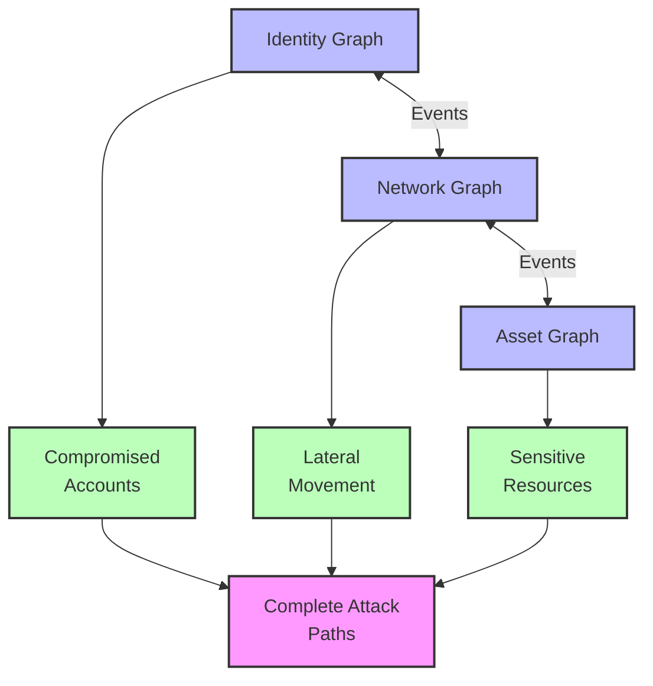

# Visualizing Graph of Graph Results

The results from "Graph of Graph" analyses can be visualized as interconnected diagrams that clearly display cross-domain relationships:

This visual representation shows how separate domain-specific analyses feed into a comprehensive understanding of potential attack paths.

## Additional Use Cases for Graph of Graph

Beyond security, the "Graph of Graph" approach in Kusto can be applied to various domains:

### Supply Chain Optimization

By analyzing:

- **Supplier Graphs**: Representing supplier relationships and capabilities
- **Logistics Graphs**: Modeling transportation routes, times, and costs
- **Inventory Graphs**: Tracking inventory levels and dependencies

Organizations can identify optimal sourcing strategies, predict potential bottlenecks, and create resilient supply chains by connecting these separate graph domains.

### Customer Journey Analysis

By connecting:

- **Customer Identity Graphs**: Representing customer profiles and segments
- **Interaction Graphs**: Modeling touchpoints across channels
- **Product Graphs**: Cataloging product relationships and dependencies

Businesses can trace complete customer journeys across channels, identify high-value conversion paths, and optimize the overall customer experience.
