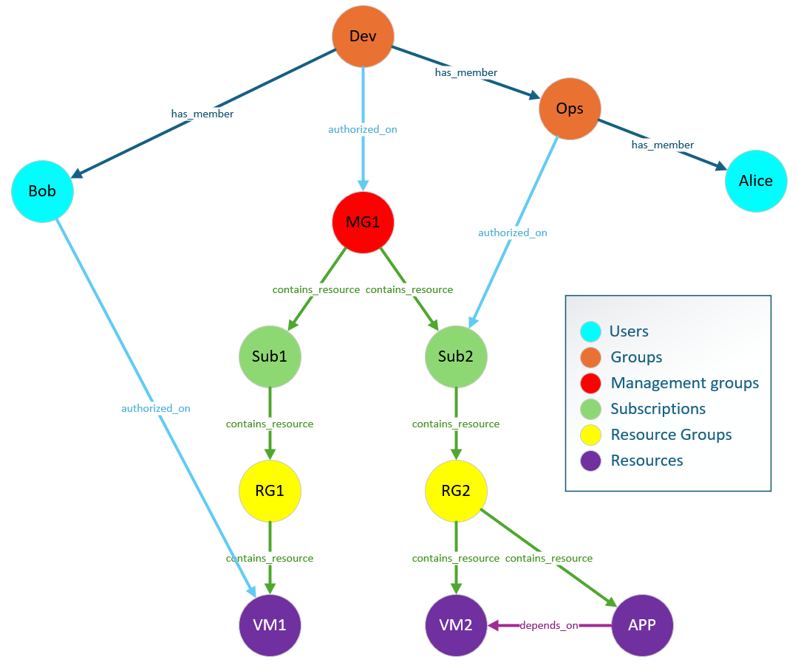

# Building a resource graph using Kusto Graph Semantics

A resource graph allows you to explore and query your resources at scale using a powerful query language. It helps you gain insights into your resource inventory, track changes, and perform complex queries to support governance, management, and security scenarios. This service is particularly useful for large environments where manual management and querying would be time-consuming and error-prone. Additionally, a resource graph is an activity graph that gets constantly updated as resources change over time.

Managing authorization and permissions on assets tracked by a resource graph is crucial for ensuring security and proper access control. Permissions can be managed by assigning them to a group or an identity. Identities can be part of a group, and groups can be nested within other groups, allowing for flexible and scalable permission management. This hierarchical structure enables administrators to efficiently manage access rights and ensure that only authorized users can interact with specific resources.

Kusto Graph Semantics is optimized for activity graphs, which represent dynamic systems where entities and their relationships change over time. The resource graph scenario focuses on the exploration and querying of resources at scale.

**Use Cases of a Resource Graph**

- **Inventory Management**: Quickly gain insights into your resource inventory across multiple environments.
- **Change Tracking**: Track changes to resources over time to support governance and compliance.
- **Complex Queries**: Perform complex queries to analyze resource information and support security scenarios.
- **Access Control**: Manage permissions efficiently using group-based permissions to enhance security.

By following the guidelines and examples provided, organizations can harness the power of Kusto to gain valuable insights into their resource inventory, track changes, and perform complex queries to support governance, management, and security scenarios.

## Getting data

To get data for a resource graph, you can use services like Azure Resource Graph to query resource changes. Refer to the [documentation on how to get resource changes](https://learn.microsoft.com/azure/governance/resource-graph/changes/get-resource-changes) for more details.

## Modelling activity graphs in Kusto

Kraph enables users to build dynamic activity graphs. The following image illustrates the final state after creating all entities as per this blueprint. This setup allows querying the latest known state of resource graphs, including historical states at specific points in time.


### Persistence layer

To represent activity graphs, we need to create schemas for Nodes and Edges, including their properties. Below is the blueprint for the nodes. Similar structures for edges and properties can be found in the [DDL](DDL.kql) file.

The node events table is capturing events for nodes and consists of the following columns:

- Action: Reflects the lifecycle of nodes. In most cases it will be either Create / Delete / Update.
- TimeStamp: Mandatory for all activity tables. It shows when a certain event happened
- TenantId: The tenant of the node.
- NodeType: The type of the node (VM, User, ...).
- Labels: The labels of the node. There could be zero or more of them.

```kusto
.create-merge table nodeEvents (Action:string, TimeStamp:datetime, TenantId:string, NodeType:string, NodeId:string, Labels:dynamic) with (folder = "Bronze", docstring = "Landing table nodes")
```

Resource graphs require streaming ingestion to reduce the time to query the data to the absolute minimum.

```kusto  
.alter table nodeEvents policy streamingingestion enable 
```

In the next steps we are going to create a derived and enriched table for nodes which will be populated by the *nodeEvents* table. It's not required to keep the raw data which saves cost.

```kusto
.alter-merge table nodeEvents policy retention softdelete = 0d recoverability = disabled
```

The *Update_NodeEvents* function extends the *nodeEvents* table with a Fully Qualified Domain Name (FQDN) to create a unique identifier for the node.

```kusto
.create function ifnotexists with (folder="Update") Update_NodeEvents () {
    nodeEvents
    | extend FQDN = strcat_delim("-", TenantId, NodeType, NodeId)
}
```

The *nodeEventsSilver* table has all columns of the *nodeEvents* table and an additional *FQDN* column which is populated by the *Update_NodeEvents* function.

```kusto
.create-merge table nodeEventsSilver (Action:string, TimeStamp:datetime, TenantId:string, NodeType:string, NodeId:string, Labels:dynamic, FQDN:string) with (folder = "Silver", docstring = "Enriched data of nodes") 
```

This statement updates the update policy for the *nodeEventsSilver* table.

````kusto
.alter table nodeEventsSilver policy update
```
[
    {
        "IsEnabled": true,
        "Source": "nodeEvents",
        "Query": "Update_NodeEvents",
        "IsTransactional": true,
        "PropagateIngestionProperties": false
    }
]
```
````

Creating a materialized view is an optimization to get to the latest known state faster.

```kusto
.create  materialized-view  nodeEventsLKV on table nodeEventsSilver { nodeEventsSilver
| summarize arg_max(TimeStamp, *) by FQDN }
```

After the materialized view created the last known state, we need to remove all deleted nodes.

```kusto
.create function ifnotexists with (folder="Consumption/Events") nodeEventsGold (interestingTenants:dynamic = dynamic([])) {
    nodeEventsLKV
    | where TenantId in (interestingTenants) or array_length(interestingTenants) == 0
    | where Action != "Delete"
}
```

Other relevant data structures include edges, node, and edge properties. They follow the same process: event streams land in a raw table, which is then updated, deduplicated, and optimized for consumption.

### Consumption layer

The consumption layer of the graph is driven by stored functions in Kusto. They can be found in the [DDL](DDL.kql) file.

This function retrieves edges necessary for graph creation. Users can specify the relevant point in time, tenants, and properties.

```kusto
.create-or-alter function with (folder = "Consumption/Graph", docstring = "Get the edges of a graph at a specific point in time", skipvalidation = "true") Edges(pointInTime:datetime, interestingTenants:dynamic = dynamic([]), interestingProperties:dynamic=dynamic([])) {
    edgeEventsSilver
    | where TimeStamp < pointInTime
    | where TenantId in (interestingTenants) or array_length(interestingTenants) == 0
    | summarize arg_max(TimeStamp, *) by FQDN
    | where Action != "Delete"
    | join kind=leftouter (
        EdgeProperties(pointInTime, interestingTenants)
        | where PropertyName in (interestingProperties) or array_length(interestingProperties) == 0
        | extend p = bag_pack(PropertyName, PropertyValue)
        | summarize Properties = make_bag(p) by FQDN
    ) on FQDN
    | project EdgeType, Action, TimeStamp, Labels, Properties, SourceFQDN, TargetFQDN, TenantId, FQDN
}
```

The following function retrieves the last known values of edges for specific tenants. It filters edge properties by an array of interesting properties or includes all if the array is empty. Using **edgeEventsGold** (based on a materialized view) reduces latency compared to query-time arg-max computation.

```kusto
.create-or-alter function with (folder = "Consumption/Graph", docstring = "Get the last known state of edges of a graph", skipvalidation = "true") EdgesLKV(interestingTenants:dynamic = dynamic([]), interestingProperties:dynamic=dynamic([])) {
    edgeEventsGold(interestingTenants)
    | join kind=leftouter (
        edgePropertyEventsGold(interestingTenants)
        | where PropertyName in (interestingProperties) or array_length(interestingProperties) == 0
        | extend p = bag_pack(PropertyName, PropertyValue)
        | summarize Properties = make_bag(p) by FQDN
    ) on FQDN
    | project EdgeType, Action, TimeStamp, Labels, Properties, SourceFQDN, TargetFQDN, TenantId, FQDN
}
```

The following functions follow the same model as the previous ones. One allows specifying a date, and the other is optimized for the last known state of a graph.

```kusto
.create-or-alter function with (folder = "Consumption/Graph", docstring = "Get the graph at a specific point in time", skipvalidation = "true") Graph(pointInTime:datetime, interestingTenants:dynamic = dynamic([]), interestingEdgeProperties:dynamic=dynamic([]), interestingNodeProperties:dynamic=dynamic([])) {
    Edges(pointInTime, interestingTenants, interestingEdgeProperties)
    | make-graph SourceFQDN --> TargetFQDN with Nodes(pointInTime, interestingTenants, interestingNodeProperties) on FQDN
} 
```

Both functions instantiate an in-memory graph object in Kusto using the `make-graph` operator. Nodes are defined by specifying a tabular expression.

```kusto
.create-or-alter function with (folder = "Consumption/Graph", docstring = "Get the last known state of the graph", skipvalidation = "true") GraphLKV(interestingTenants:dynamic = dynamic([]), interestingEdgeProperties:dynamic=dynamic([]), interestingNodeProperties:dynamic=dynamic([])) {
    EdgesLKV(interestingTenants, interestingEdgeProperties)
    | make-graph SourceFQDN --> TargetFQDN with NodesLKV(interestingTenants, interestingNodeProperties) on FQDN
}
```

## Ingesting sample data

This section creates a sample resource graph. It creates a classic multi-tenant resource graph with core components such as management groups (collection of subscriptions), subscriptions and resource groups which can contain resources. Additionally it is modelling users and groups in the same graph as another resource type which does not need to reside in a resource group. This approach allows implementing the central use-cases of resource graphs as mentioned above.



The following script, found in the [DDL](DDL.kql) file, uses a series of set-or-replace commands to ingest data into the event tables for nodes, edges, and properties. Update policies populate the derived tables, and materialized views are populated automatically.

```kusto
.execute script <|
.set-or-replace nodeEvents <|
datatable(Action:string, TimeStamp:datetime, TenantId:string, NodeType:string, NodeId:string, Labels:dynamic)
[
    "Create", datetime(2024-10-21T00:00:00.0000000Z), "Contoso", "Group", "Dev", dynamic([]), 
    "Create", datetime(2024-10-21T00:00:00.0000000Z), "Contoso", "Group", "Ops", dynamic([]), 
    "Create", datetime(2024-10-21T00:00:00.0000000Z), "Contoso", "User", "Alice", dynamic([]), 
    "Create", datetime(2024-10-21T00:00:00.0000000Z), "Contoso", "User", "Bob", dynamic([]), 
    "Create", datetime(2024-10-21T00:00:00.0000000Z), "Contoso", "ManagementGroup", "MG1", dynamic([]), 
    "Create", datetime(2024-10-21T00:00:00.0000000Z), "Contoso", "Subscription", "Sub1", dynamic([]), 
    "Create", datetime(2024-10-21T00:00:00.0000000Z), "Contoso", "Subscription", "Sub2", dynamic([]), 
    "Create", datetime(2024-10-21T00:00:00.0000000Z), "Contoso", "ResourceGroup", "RG1", dynamic([]), 
    "Create", datetime(2024-10-21T00:00:00.0000000Z), "Contoso", "ResourceGroup", "RG2", dynamic([]), 
    "Create", datetime(2024-10-21T00:00:00.0000000Z), "Contoso", "VirtualMachine", "VM1", dynamic([]), 
    "Create", datetime(2024-10-21T00:00:00.0000000Z), "Contoso", "VirtualMachine", "VM2", dynamic([]), 
    "Create", datetime(2024-10-21T00:00:00.0000000Z), "Contoso", "Application", "APP", dynamic([]), 
]
.set-or-replace edgeEvents <|
datatable(Action:string, TimeStamp:datetime, TenantId:string, EdgeType:string, SourceTenantId:string, SourceNodeType:string, SourceNodeId:string, TargetTenantId:string, TargetNodeType:string, TargetNodeId:string, Labels:dynamic)
[
    "Create", datetime(2024-10-21T00:00:00.0000000Z), "Contoso", "has_member", "Contoso", "Group", "Dev", "Contoso", "Group", "Ops", dynamic([]), 
    "Create", datetime(2024-10-21T00:00:00.0000000Z), "Contoso", "has_member", "Contoso", "Group", "Ops", "Contoso", "User", "Alice", dynamic([]), 
    "Create", datetime(2024-10-21T00:00:00.0000000Z), "Contoso", "has_member", "Contoso", "Group", "Dev", "Contoso", "User", "Bob", dynamic([]), 
    "Create", datetime(2024-10-21T00:00:00.0000000Z), "Contoso", "contains_resource", "Contoso", "ManagementGroup", "MG1", "Contoso", "Subscription", "Sub1", dynamic([]), 
    "Create", datetime(2024-10-21T00:00:00.0000000Z), "Contoso", "contains_resource", "Contoso", "ManagementGroup", "MG1", "Contoso", "Subscription", "Sub2", dynamic([]), 
    "Create", datetime(2024-10-21T00:00:00.0000000Z), "Contoso", "contains_resource", "Contoso", "Subscription", "Sub1", "Contoso", "ResourceGroup", "RG1", dynamic([]), 
    "Create", datetime(2024-10-21T00:00:00.0000000Z), "Contoso", "contains_resource", "Contoso", "Subscription", "Sub2", "Contoso", "ResourceGroup", "RG2", dynamic([]), 
    "Create", datetime(2024-10-21T00:00:00.0000000Z), "Contoso", "contains_resource", "Contoso", "ResourceGroup", "RG1", "Contoso", "VirtualMachine", "VM1", dynamic([]), 
    "Create", datetime(2024-10-21T00:00:00.0000000Z), "Contoso", "contains_resource", "Contoso", "ResourceGroup", "RG2", "Contoso", "VirtualMachine", "VM2", dynamic([]), 
    "Create", datetime(2024-10-21T00:00:00.0000000Z), "Contoso", "contains_resource", "Contoso", "ResourceGroup", "RG2", "Contoso", "Application", "APP", dynamic([]),
    "Create", datetime(2024-10-21T00:00:00.0000000Z), "Contoso", "depends_on", "Contoso", "Application", "APP", "Contoso", "VirtualMachine", "VM2", dynamic([]), 
    "Create", datetime(2024-10-21T00:00:00.0000000Z), "Contoso", "authorized_on", "Contoso", "Group", "Dev", "Contoso", "ManagementGroup", "MG1", dynamic(["Reader"]), 
    "Create", datetime(2024-10-21T00:00:00.0000000Z), "Contoso", "authorized_on", "Contoso", "Group", "Ops", "Contoso", "Subscription", "Sub2", dynamic(["Owner"]), 
    "Create", datetime(2024-10-21T00:00:00.0000000Z), "Contoso", "authorized_on", "Contoso", "User", "Bob", "Contoso", "VirtualMachine", "VM1", dynamic(["Reader"]), 
]
.set-or-replace edgePropertyEvents <|
datatable(Action:string, TimeStamp:datetime, TenantId:string, EdgeType:string, SourceTenantId:string, SourceNodeType:string, SourceNodeId:string, TargetTenantId:string, TargetNodeType:string, TargetNodeId:string, PropertyName:string, PropertyValue:dynamic)
[
    "Add", datetime(2024-10-21T00:00:00.0000000Z), "Contoso", "authorized_on", "Contoso", "User", "Bob", "Contoso", "VirtualMachine", "VM1", "LocationFilter", dynamic(["UK"]), 
]
.set-or-replace nodePropertyEvents <|
datatable(Action:string, TimeStamp:datetime, TenantId:string, NodeType:string, NodeId:string, PropertyName:string, PropertyValue:dynamic)
[
    "Add", datetime(2024-10-21T00:00:00.0000000Z), "Contoso", "User", "Alice", "Age", dynamic("42"), 
    "Add", datetime(2024-10-21T00:00:00.0000000Z), "Contoso", "User", "Alice", "Location", dynamic("UK"), 
    "Add", datetime(2024-10-21T00:00:00.0000000Z), "Contoso", "User", "Bob", "Location", dynamic("Germany"), 
    "Add", datetime(2024-10-21T00:00:00.0000000Z), "Contoso", "User", "VM1", "Region", dynamic("UK South"), 
    "Add", datetime(2024-10-21T00:00:00.0000000Z), "Contoso", "User", "VM2", "Region", dynamic("West Europe"), 
    "Add", datetime(2024-10-21T00:00:00.0000000Z), "Contoso", "User", "RG2", "Region", dynamic("West Europe"), 
    "Add", datetime(2024-10-21T00:00:00.0000000Z), "Contoso", "User", "RG1", "Region", dynamic("UK South"), 
]
```

## Visualize the graph


## Common query patterns

```kusto
let tenants=dynamic(["Contoso"]);
NodesLKV(interestingTenants=tenants)
```

```kusto
let properties = dynamic(["Age"]);
NodesLKV(interestingProperties=properties)
```

```kusto
Nodes(datetime(2024-10-22))
```

```kusto
EdgesLKV()
```

```kusto
let properties = dynamic(["LocationFilter"]);
Edges(datetime(2024-10-22), interestingProperties=properties)
```

```kusto
let tenants=dynamic(["Contoso"]);
let nodeProperties = dynamic(["Age"]);
let edgeProperties = dynamic(["LocationFilter"]);
GraphLKV(interestingTenants=tenants, interestingEdgeProperties=edgeProperties, interestingNodeProperties=nodeProperties)
```

```kusto
Graph(now())
```

```kusto
//Statistics on resource assignments
let interestingUser = "Alice";
let tenants=dynamic(["Contoso"]);
GraphLKV(interestingTenants=tenants)
| graph-match (resource)<-[authorized_on*1..4]-(group)-[hasMember*1..255]->(user)
    where user.NodeId == interestingUser and user.NodeType == "User" and hasMember.EdgeType == "has_member" and group.NodeType == "Group" and
        authorized_on.EdgeType in ("authorized_on", "contains_resource")
    project Username=user.NodeId, userFQDN=user.FQDN, resourceTenantId=resource.TenantId, resourceType=resource.NodeType, resourceName=resource.NodeId
| summarize Username = take_any(Username), Tenants=dcount(resourceTenantId), ResourceTypes=dcount(resourceType), Resources=dcount(resourceName) by userFQDN
```

```kusto
//Check Bob, who has direct and group based access to resources
let interestingUser = "Bob";
let G = GraphLKV();
let groupBasedAccess = view() {
    G
    | graph-match (resource)<-[authorized_on*1..4]-(group)-[hasMember*1..255]->(user)
        where user.NodeId == interestingUser and user.NodeType == "User" and hasMember.EdgeType == "has_member" and group.NodeType == "Group" and
            authorized_on.EdgeType in ("authorized_on", "contains_resource")
        project Username=user.NodeId, userFQDN=user.FQDN, resourceTenantId=resource.TenantId, resourceType=resource.NodeType, resourceName=resource.NodeId
};
let directAccess = view() {
    G
    | graph-match (resource)<-[authorized_on*1..4]-(user)
        where user.NodeId == interestingUser and user.NodeType == "User" and
            authorized_on.EdgeType in ("authorized_on", "contains_resource")
        project Username=user.NodeId, userFQDN=user.FQDN, resourceTenantId=resource.TenantId, resourceType=resource.NodeType, resourceName=resource.NodeId
};
union withsource=Assignment groupBasedAccess, directAccess
| summarize Username = take_any(Username), Tenants=dcount(resourceTenantId), ResourceTypes=dcount(resourceType), Resources=dcount(resourceName) by userFQDN, Assignment
```

```kusto
//Check Bob, who has direct and group based access to resources
let interestingUsers = dynamic(["Bob", "Alice"]);
let G = GraphLKV();
let groupBasedAccess = view() {
    G
    | graph-match (resource)<-[authorized_on*1..4]-(group)-[hasMember*1..255]->(user)
        where user.NodeId in (interestingUsers) and user.NodeType == "User" and hasMember.EdgeType == "has_member" and group.NodeType == "Group" and
            authorized_on.EdgeType in ("authorized_on", "contains_resource")
        project Username=user.NodeId, userFQDN=user.FQDN, resourceTenantId=resource.TenantId, resourceType=resource.NodeType, resourceName=resource.NodeId
};
let directAccess = view() {
    G
    | graph-match (resource)<-[authorized_on*1..4]-(user)
        where user.NodeId in (interestingUsers) and user.NodeType == "User" and
            authorized_on.EdgeType in ("authorized_on", "contains_resource")
        project Username=user.NodeId, userFQDN=user.FQDN, resourceTenantId=resource.TenantId, resourceType=resource.NodeType, resourceName=resource.NodeId
};
union withsource=Assignment groupBasedAccess, directAccess
| summarize Username = take_any(Username), Tenants=dcount(resourceTenantId), ResourceTypes=dcount(resourceType), Resources=dcount(resourceName) by userFQDN, Assignment
```

```kusto
//Provide all permissions of a user on VMs
let interestingUsers = dynamic(["Alice", "Bob"]);
let interestingResourceTypes = dynamic(["VirtualMachine"]);
let tenants=dynamic(["Contoso"]);
let G = GraphLKV(interestingTenants=tenants);
let groupBasedAccess = view() {
    G
    | graph-match (resource)<-[authorized_on*1..4]-(group)-[hasMember*1..255]->(user)
        where user.NodeId in (interestingUsers) and user.NodeType == "User" and hasMember.EdgeType == "has_member" and group.NodeType == "Group" and
            authorized_on.EdgeType in ("authorized_on", "contains_resource") and resource.NodeType in (interestingResourceTypes)
        project Username=user.NodeId, userFQDN=user.FQDN, resourceTenantId=resource.TenantId, resourceType=resource.NodeType, resourceName=resource.NodeId, AuthorizationLabels=authorized_on.Labels
};
let directAccess = view() {
    G
    | graph-match (resource)<-[authorized_on*1..4]-(user)
        where user.NodeId in (interestingUsers) and user.NodeType == "User" and
            authorized_on.EdgeType in ("authorized_on", "contains_resource")
        project Username=user.NodeId, userFQDN=user.FQDN, resourceTenantId=resource.TenantId, resourceType=resource.NodeType, resourceName=resource.NodeId, AuthorizationLabels=authorized_on.Labels
};
union withsource=Assignment groupBasedAccess, directAccess
| mv-apply AuthLabel=AuthorizationLabels on (
    where array_length(AuthLabel) > 0
)
| mv-expand AuthLabel to typeof(string)
| summarize Permissions=make_set(AuthLabel) by userFQDN, resourceTenantId, resourceType, resourceName
```

```kusto
//Blast radius... what happens if a resource is not working? Which users are impacted?
let interestingResourceTypes = dynamic(["VirtualMachine"]);
let interestingResources = dynamic(["VM1"]);
let tenants=dynamic(["Contoso"]);
GraphLKV(interestingTenants=tenants)
| graph-match cycles=none (resource)-[e*1..255]-(user)
    where resource.NodeId in (interestingResources) and resource.NodeType in (interestingResourceTypes) and user.NodeType == "User"
    project Username=user.NodeId, Tenant=user.TenantId, userFQDN=user.FQDN
| distinct userFQDN, Username, Tenant
```
